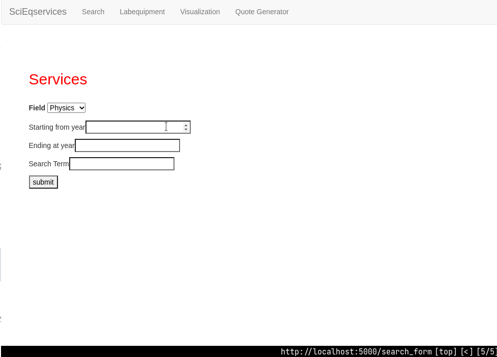
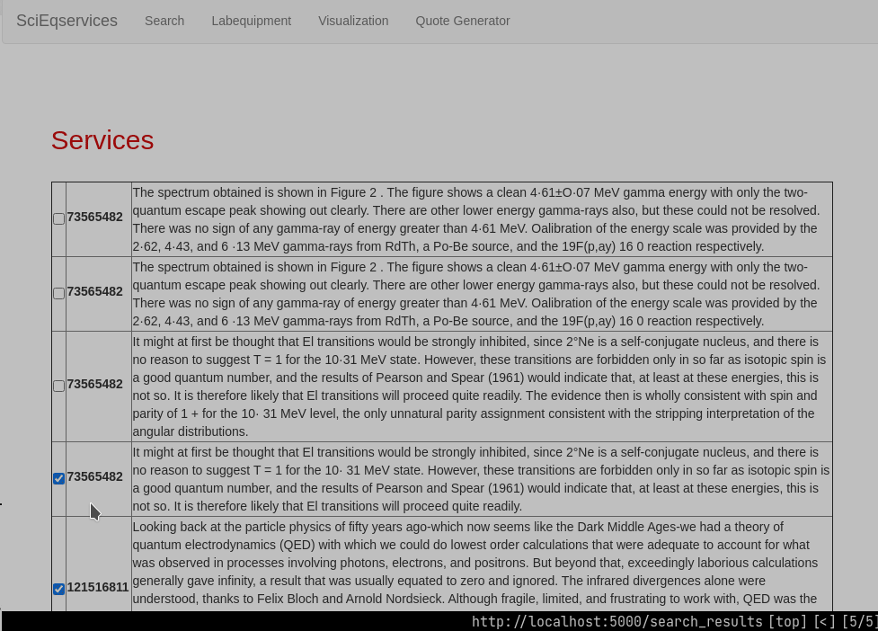

SciEQ - Semantic similarity for the S2ORC data
==============================================

SciEQ is a web interface to extract insights from the user's copy of S2ORC's abstracts and full-text database. The user will be able to  compile data on research areas and groups that use similar technologies (software and instruments) in their work.

Code Layout
===========

There are two parts to the code

Semantic similarity
-------------------

The S2orc data should be made available in a Mongodb database so that it can be accessed by the software using `pymongo`.

In order to find papers similar to a target set, the code currently uses TFIDF.

- Scikit-learn's TDIDF method is supplied the database in the form of batches through a batch generator. Count Vectors for the batches are generated and stacked before transforming using the TFIDFTransformer.
- Cosine similarity is evaluated using the scikit-learn's NearestNeighbours method to generate a list of four most similar papers to display to the user.

Semantic evaluation will be expanded to include more advanced models going ahead.

Web Interface
-------------

A basic flask based interface allows the user to access the software remotely. The basic routes available are:

1. http://localhost:5000/search_form: Allows the user to input the name of the technology (software or equipment) he is interested in. User can filter by subject and date range.

2. http://localhost:5000/search_results: Full text database is searched through and occurences are listed. User can select papers of interest for similarity search through the abstract database. User can filter by subject and date range.

3. http://localhost:5000/semantic_results: Displays the abstracts of the nearest neighbours to the user selected papers.

Dependencies
============

The S2ORC database can be obtained by contacting the authors at [AllenAI](https://github.com/allenai/s2orc).
The database needs to be inserted into a Mongodb. Code for the same area available in `src/data/s2orcmongodb`
The connection details, database and collection names entered in the `data/accessdb.py` file.

Several python modules are necessary which can be easily obtained from pip and installed in a virtual environment using: `pip install -r requirements.txt`.

The main python dependencies are:
pymongo - driver for MongoDB
spaCy - for the tokenizer
scikit-learn - for TFIDF and NearestNeighbours methods
scipy - for the batch processing of the database
Flask - for the webinterface

Using the code
==============

Once the details of the database has been created, the user only needs to run `python src/interface` to fire up the web server. The software will now be available on http://localhost:5000/search_form.

